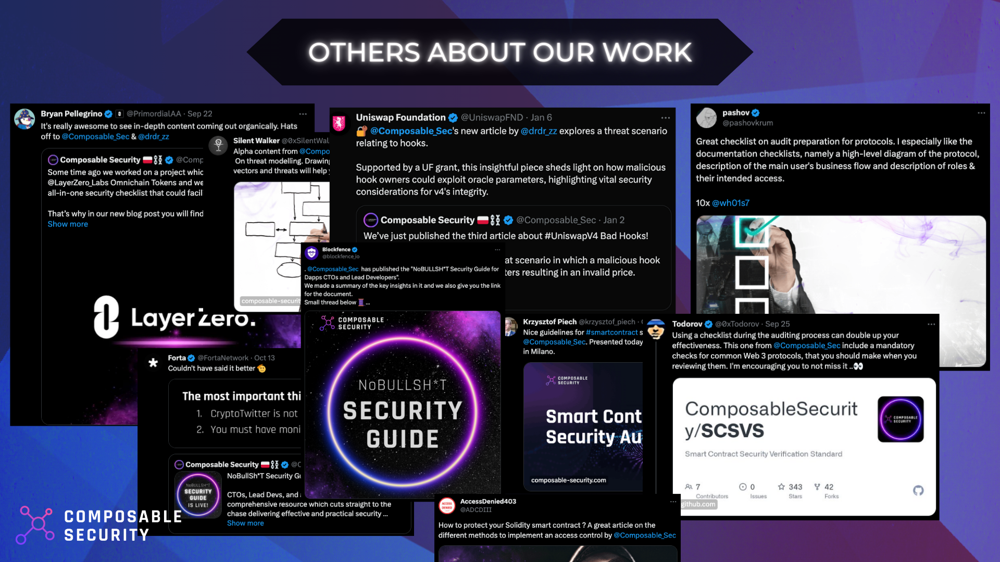
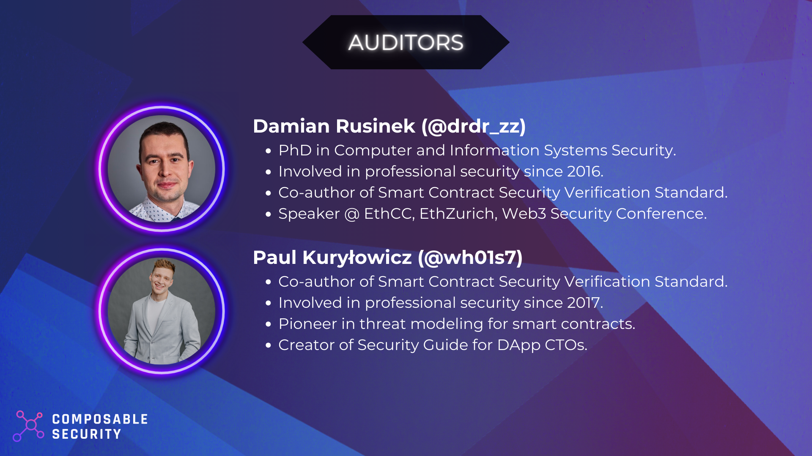
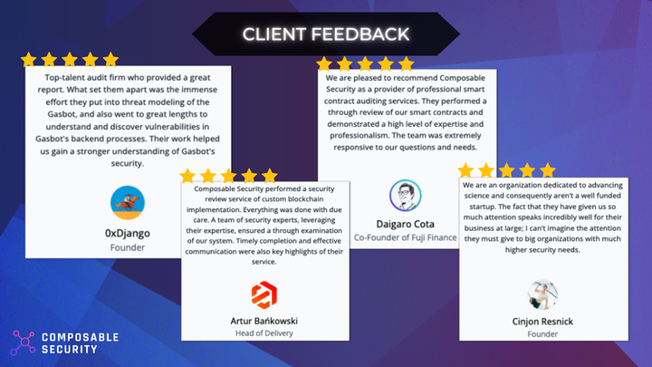

# Composable Security

## Get to know us

[Composable Security 🛡️⛓️](https://twitter.com/Composable_Sec) performs **threat-based security reviews that go beyond code**, across **Smart Contracts, Off-chain Components and AI Integrations**. We review smart contracts, custom blockchain implementations, oracles, bridges, relayers and backend services, looking at how the whole system works and where its assumptions can break.

We are actively expanding our work in **AI security**, researching emerging threats and reviewing AI agents, LLM-powered applications, AI workflows and development environments. Our focus includes prompt injection, unsafe tool access, data exposure and the risks that arise when AI can act on real systems.

Since 2022, we have repeatedly worked at the frontier of new technology, taking on security challenges where established practices and specialist expertise were still limited. From custom blockchain implementations to complex AI integrations and AI agents, we combine this hands-on experience with the knowledge gained during our earlier **6+ years securing global fintechs and Polish banks**.

**Trusted by market leaders including Mistral AI, Lido, RedStone, Tellor and Filecoin**, alongside YieldNest, Othentic and many more.

Learn more [about us](https://composable-security.com/about/) and [our work](https://composable-security.com/our-work/).

Read about [our approach to smart contract audits](https://composable-security.com/blog/how-we-do-smart-contract-audit/).

## Proud of 🏆

* Creators of the **[Smart Contract Security Verification Standard (SCSVS)](https://github.com/ComposableSecurity/SCSVS)**.
* **ETHSecurity Badge holders**.
* Part of the **Lido DAO GateSeal / CircuitBreaker Committee**.
* Part of the **first accreditation cohort of the Security Alliance's [SEAL Certification program](https://securityalliance.org/our-work/certifications)**, currently undergoing accreditation.
* Our **Uniswap V4 security research** was supported by a **Uniswap Foundation grant**.
* Our articles are valued by projects such as **Morpho Blue and LayerZero**.
* **Speakers and mentors** at EthCC, ETHGlobal London, Web3 Security Conference, EthereumZurich and more.
* Creators of the **[Security Guide for DApps](https://composable-security.com/security-guide/)**: 100+ pages of free, practical security knowledge.
* **Two-time War Room Games winners**: Paris at EthCC 2023 and Brussels at EthCC 2024.
* Before founding Composable Security, we developed an interactive video training program that **trained 1,000+ developers**.

## Services

* **Smart contract audits and security reviews**.
* **AI security reviews**: AI integrations, agents, LLM-powered applications, workflows and development environments.
* **Off-chain component security reviews**: oracles, bridges, relayers and backend services.
* **Custom blockchain implementation security reviews**.
* **Threat modeling and threat analysis**.
* **SEAL Certification assessments**: operational security reviews within the SEAL Certification program, while undergoing accreditation.
* **Security consultations**.

[Contact us](https://composable-security.com/) to discuss your project.

## Client reviews

## Professional collaboration

Companies that have allowed us to speak about our work can be found here:

| Client                                                      | Project type                                                                                                                             | Service                           | Date                  |                                                Report                                                |
| ----------------------------------------------------------- | ---------------------------------------------------------------------------------------------------------------------------------------- | --------------------------------- | --------------------- | :--------------------------------------------------------------------------------------------------: |
| [Tellor](https://tellor.io/)                                | Oracle                                                                                                                                   | Smart contract security review    | October 2026 | - |
| [Rain](https://www.rain.one/)                               | Stablecoin payments                                                                                                                      | Smart contract security review    | September 2026            | - |
| [Lido](https://lido.fi/)                                    | Liquid staking, Oracle, Off-chain components                                                                                             | Security consultation & review    | September 2026            | - |
| [Rain](https://www.rain.one/)                               | Stablecoin payments                                                                                                                      | Smart contract security review    | August 2026            | - |
| [Mistral AI](https://mistral.ai/)                           | AI security, LLM, AI integration                                                                                                         | Security consultation & AI integration review    | August 2026            | - |
| [Lido](https://lido.fi/)                                    | Liquid staking                                                                                                                           | Smart contract security review    | August 2026            | - |
| [Prime Delta](https://primedelta.io/)                       | DEX, Tokenized stocks, RWA                                                                                                               | Smart contract security review    | July 2026              | - |
| FIDL: Filecoin Incentive Design Labs                        | Filecoin, FVM                                                                                                                            | Smart contract security review    | July-August 2026       | - |
| [Lido](https://lido.fi/)                                    | Liquid staking, Oracle V8, Pectra, EIP-7251 consolidations, 0x02 compounding validators, Staking Router V3, Python, Off-chain components | Security consultation & review    | March 2025 - May 2026 | [📄](https://github.com/ComposableSecurity/.github/blob/main/reports/2026_05_Lido_Oracle_V8.pdf) |
| [Tellor](https://tellor.io/)                                | Oracle                                                                                                                                   | Smart contract security review    | March 2026 | - |
| [Lido](https://lido.fi/)                                    | Liquid staking, Lido V3, stVaults, Oracle, Python, Off-chain components                                                                  | Security consultation & review    | February 2026 | [📄](https://github.com/ComposableSecurity/.github/blob/main/reports/2026_02_Lido_Oracle_V7_1.pdf) |
| [Filecoin](https://filecoin.io/)                            | Filecoin, FVM                                                                                                                            | Smart contract security review    | January - February 2026 | - |
| [BB Trade](https://zondacrypto.com/)                        | Exchange                                                                                                                                 | Smart contract security review    | January 2026 | - |
| [Neverland](https://neverland.money/)                       | Lending protocol, Monad                                                                                                                  | Smart contract security review    | December 2025 - January 2026 | - |
| [Arkiv Network](https://arkiv.network/)                     | L2, Rollup                                                                                                                               | Smart contract security review    | October 2025 | - |
| [Lido](https://lido.fi/)                                    | Liquid staking, Lido V3, stVaults, stETH minting, Oracle, EIP-7002, Off-chain components                                                 | Security consultation & review    | September - October 2025 | [📄](https://github.com/ComposableSecurity/.github/blob/main/reports/2025_09_Lido_Oracle_V7_second.pdf) |
| [Lido](https://lido.fi/)                                    | Liquid staking, Accounting Oracle, Withdrawal finalization, Docker image verification, Off-chain components                              | Security consultation & review    | September 2025 | [📄](https://github.com/ComposableSecurity/.github/blob/main/reports/2025_09_Lido_Oracle_V6_0_2.pdf) |
| [Neverland](https://neverland.money/)                       | Lending protocol, Aave V3 fork, Self-repaying loans, veNFT, Rewards, Monad                                                               | Smart contract security review    | September 2025 | [📄](https://github.com/ComposableSecurity/.github/blob/main/reports/202509_Neverland_SelfRepay.pdf) |
| [Othentic](https://www.othentic.xyz/)                       | AVS, Restaking, EigenLayer                                                                                                               | Smart contract security review    | September 2025 | - |
| [Lido](https://lido.fi/)                                    | Liquid staking, Oracle, Node operator keys, Rewards distribution, Docker image verification, Off-chain components                        | Security consultation & review    | August 2025 | [📄](https://github.com/ComposableSecurity/.github/blob/main/reports/2025_08_Lido_Oracle_V5_4_1.pdf) |
| [Neverland](https://neverland.money/)                       | Lending protocol, Aave V3 fork, Vote-escrow (veNFT), ERC-721, Revenue rewards, Monad                                                     | Smart contract security review    | July - August 2025 | [📄](https://github.com/ComposableSecurity/.github/blob/main/reports/2025_08_Neverland.pdf) |
| [Lido](https://lido.fi/)                                    | Liquid staking, Lido V3, stVaults, Oracle, EIP-7002, 0x02 withdrawal credentials, Fee and APR accounting, Off-chain components           | Security consultation & review    | July - August 2025 | [📄](https://github.com/ComposableSecurity/.github/blob/main/reports/2025_07_Lido_Oracle_V7.pdf) |
| [Lido](https://lido.fi/)                                    | Liquid staking, Oracle V6, Community Staking Module (CSM), Validator strikes, Validator Exit Bus, Merkle trees, Off-chain components     | Security consultation & review    | June - July 2025 | [📄](https://github.com/ComposableSecurity/.github/blob/main/reports/2025_06_Lido_Oracle_V6.pdf) |
| [Lido](https://lido.fi/)                                    | Liquid staking, Oracle hotfix, Front-running, CSM rewards, Off-chain components                                                          | Security consultation & review    | June 2025 | [📄](https://github.com/ComposableSecurity/.github/blob/main/reports/2025_06_Lido_Oracle_V5_2.pdf) |
| [Shroomy](https://www.shroomy.io/)                          | Staking, Revenue distribution, Aave V3, Swapper                                                                                          | Smart contract security review    | May 2025 | [📄](https://github.com/ComposableSecurity/.github/blob/main/reports/2025_05_Shroomy_Staking.pdf) |
| [Constellation Network](https://constellationnetwork.io/)   | Custom blockchain, L0, DAG, Non-EVM                                                                                                      | Security consultation & review    | March-April 2025 | - |
| [Lido](https://lido.fi/)                                    | Liquid staking, Oracle V5, Pectra, Slashing, Validator ejection, Withdrawals, Off-chain components                                       | Security consultation & review    | February-March 2025 | [📄](https://github.com/ComposableSecurity/.github/blob/main/reports/2025_02_Lido_Oracle_V5.pdf) |
| [Othentic](https://www.othentic.xyz/)                       | AVS, Restaking, EigenLayer, Rewards, LayerZero, Cross-chain, L2                                                                          | Smart contract security review    | February 2025 | [📄](https://github.com/ComposableSecurity/.github/blob/main/reports/2025_02_Othentic_RewardsV2.pdf) |
| [Arbiter Finance](https://arbiter.finance/)                 | AMM, Uniswap V4 hooks                                                                                                                    | Smart contract security review    | January 2025 | - |
| [Tellor](https://tellor.io/)                                | Oracle                                                                                                                                   | Smart contract security review    | January 2025 | - |
| [YieldNest](https://www.yieldnest.finance/)                 | Liquid restaking, ERC-4626 vaults, Max Vaults, Kernel, BNB Chain                                                                         | Smart contract security review    | December 2024 | [📄](https://github.com/ComposableSecurity/.github/blob/main/reports/2024_12_YieldNest_Integration_with_Kernel.pdf) |
| [Arcade](https://www.arcade2earn.io/)                       | GameFi                                                                                                                                   | Smart contract security review    | December 2024 | - |
| [Bitquity](https://www.bitquity.org/)                       | Stablecoin, BTC-backed                                                                                                                   | Smart contract security review    | December 2024 | - |
| [pStake](https://pstake.finance/)                           | Liquid staking                                                                                                                           | Smart contract security review             | November 2024            | - |
| Token Invest                                                | -                                                                                                                                        | Smart contract security review             | October 2024            | - |
| [RedStone](https://redstone.finance/)                       | Oracle, AVS, EigenLayer, Restaking, Price feeds, Aggregator, Off-chain components                                                        | Smart contract security review and security consultation | October 2024            | [📄](https://github.com/ComposableSecurity/.github/blob/main/reports/2024_10_RedStone_AVS.pdf) |
| [Braintrust](https://www.usebraintrust.com/)                  | Safe wallet, Coinbase onramp, Backend API, Base, Off-chain components                                                                    | Security consultation             | August 2024            | [📄](https://github.com/ComposableSecurity/.github/blob/main/reports/2024_09_Braintrust.pdf)  |
| [Arcade](https://www.arcade2earn.io/)                       | GameFi, Rewards, Signatures                                                                                                              | Smart contract security review    | July 2024 |  [📄](https://github.com/ComposableSecurity/.github/blob/main/reports/2024_07_Arcade_Mission_Pools.pdf) |
| [ZND](https://znd.co/)                                        | -                                                                                                                                        | Smart contract security review    | July 2024              | - |
| [Empirica](https://empirica.io/)                              | -                                                                                                                                        | Security consultation             | July 2024              | - |
| [Flexy](https://www.flexy.tech/)                              | Cross-chain gas, Relayer, Permit2, Backend pentest, Off-chain components                                                                 | Smart contract security review    | June 2024              | [📄](https://github.com/ComposableSecurity/.github/blob/main/reports/2024_07_Flexy.pdf) |
| Tident IT                                                     | -                                                                                                                                        | Smart contract security review    | June 2024              | - |
| [ICEO](https://iceo.co/)                                    | -                                                                                                                                        | Security consultation             | May 2024              | - |
| FIDL: Filecoin Incentive Design Labs                        | Filecoin, FVM, Filecoin Plus, DataCap allocation, Access control                                                                         | Smart contract security review    | May 2024              | [📄](https://github.com/ComposableSecurity/.github/blob/main/reports/2024_05_FIDL_MetaAllocator.pdf) |
| [Sharbi](https://www.sharbi.net/)                           | Token                                                                                                                                    | Smart contract security review    | March-April 2024      |                                                  -                                                   |
| Outline Investments                                         | -                                                                                                                                        | Security consultation             | March 2024            |                                                  -                                                   |
| [ChickenDAO](https://coconutchicken.com/)                   | Telegram bot, Token gating, DApp frontend, Threat analysis, Off-chain components                                                         | Security consultation             | March 2024            | [📄](https://github.com/ComposableSecurity/.github/blob/main/reports/2024_03_ChickenDAO_TG_bot.pdf)  |
| [Arcade](https://www.arcade2earn.io/)                       | GameFi, Vesting, Airdrop, EIP-712 signatures, Token                                                                                      | Smart contract security review    | January-February 2024 |  [📄](https://github.com/ComposableSecurity/.github/blob/main/reports/2024_02_Arcade_Mission_Pools.pdf) |
| [Gasbot](https://www.gasbot.xyz/)                           | Cross-chain gas, Relayer, Uniswap, Stablecoins, Polygon, Off-chain components                                                            | Smart contract security review    | January 2024          | [📄](https://github.com/ComposableSecurity/.github/blob/main/reports/2024_01_Gasbot_V2.pdf)          |
| [codefunded](https://codefunded.com/)                       | OTC, Order book, ERC-721 orders, Batch execution, Plugins, Polygon                                                                       | Smart contract security review    | November 2023         | [📄](https://github.com/ComposableSecurity/.github/blob/main/reports/2023_11_Codefunded.pdf)         |
| [Uniswap Foundation](https://www.uniswapfoundation.org/)    | Uniswap V4 hooks, AMM, Threat modeling                                                                                                   | Security research on UniV4 Hooks  | October-December 2023 |                                                  -                                                   |
| [Research Portfolio](https://researchportfolio.co/research) | DeSci, Research tokens, ERC-1155, ERC-20, Donations, Web application                                                                     | Smart contract security review    | August-September 2023 | [📄](https://github.com/ComposableSecurity/.github/blob/main/reports/2023_09_Research_Portfolio.pdf) |
| [evojam](https://evojam.com/)                               | Custom blockchain                                                                                                                        | Custom blockchain security review | May-June 2023         |                                                  -                                                   |
| [VolMEX Finance](https://volmex.finance/)                   | Derivatives, Volatility                                                                                                                  | Smart contract security review    | April 2023            |                                                  -                                                   |
| [DIVA Protocol](https://www.divaprotocol.io/)               | Derivatives, Diamond proxy (EIP-2535), ERC-165, Ownership, Vesting                                                                       | Smart contract security review    | March 2023            | [📄](https://github.com/ComposableSecurity/.github/blob/main/reports/2023_03_DIVAprotocol.pdf)       |
| [Milky Ice](https://milkyice.io/)                           | Staking, Governance, ERC-20, EIP-2612 permit, Uniswap TWAP                                                                               | Smart contract security review    | January 2023          | [📄](https://github.com/ComposableSecurity/.github/blob/main/reports/2023_01_MilkyIce.pdf)           |
| Outline Investments                                         | -                                                                                                                                        | Security consultation             | December 2022         |                                                  -                                                   |
| Outline Investments                                         | -                                                                                                                                        | Security consultation             | November 2022         |                                                  -                                                   |
| [FujiDAO Labs OU](https://www.fujidao.org/)                 | Lending aggregator, Cross-chain, Connext, ERC-4626, EIP-5143, Timelock                                                                   | Smart contract security review    | November 2022         | [📄](https://github.com/ComposableSecurity/.github/blob/main/reports/2022_11_Fujidao_Labs_OU.pdf)    |
| [FujiDAO Labs OU](https://www.fujidao.org/)                 | Lending aggregator, Cross-chain                                                                                                          | Smart contract security review    | October 2022          |                                                  -                                                   |
| W3 CPI, Inc.                                                | -                                                                                                                                        | Smart contract security review    | September 2022        |                                                  -                                                   |
| [Tellor Inc.](https://tellor.io/)                           | Oracle                                                                                                                                   | Smart contract security review    | August 2022           |                                                  -                                                   |

Many more remain confidential.
## Client case studies

* [Lido – Security Review of Oracle V8 update](https://composable-security.com/blog/lido-security-review-of-oracle-v8-update/)
* [Red Stone – Security review of Oracle AVS](https://composable-security.com/blog/red-stone-security-review-of-oracle-avs/)
* [Neverland – Security Review of lending protocol](https://composable-security.com/blog/neverland-security-review-of-lending-protocol/)
* [Lido – Security Review of Oracle V5 update](https://composable-security.com/blog/lido-security-review-of-oracle-v5-update/)
* [Othentic – Security Review of Rewards V2](https://composable-security.com/blog/othentic-security-review-of-rewards-v2/)
* [YieldNest – Security Review of Max Vaults and integration with Kernel](https://composable-security.com/blog/yieldnest-security-review-of-max-vaults-and-integration-with-kernel/)
* [Braintrust – Safe Wallet and Coinbase Integration](https://composable-security.com/blog/braintrust-safe-wallet-and-coinbase-integration/)
* [Outline Investment – Case Study](https://composable-security.com/blog/outline-investment-case-study/)
* [Gasbot V2 – Case Study](https://composable-security.com/blog/gasbot-v2-case-study/)
* [Research Portfolio – Case Study](https://composable-security.com/blog/research-portfolio-case-study/)
* [Tapioca – Key threat based security review during the contest](https://composable-security.com/blog/tapioca-key-threat-based-security-review-during-the-contest/)

## Contests

We take part in security contests when a project interests us and our schedule allows.

| Project                                                     |  H  | M | Place |                                               Description                                           |
| ----------------------------------------------------------- |  -  | - | ----- |:--------------------------------------------------------------------------------------------------:|
| [Titles](https://audits.sherlock.xyz/contests/326)         |  2  | 6 | **4th** out of 201 participants  |TITLES builds creative tools powered by artist-owned AI models. The underlying TITLES protocol enables the publishing of referential NFTs, including managing attribution and splitting payments with the creators of the attributed works.                        |
| [Mento](https://audits.sherlock.xyz/contests/187)         |  0  | 1 | **🥇1st** out of 83 participants |Mento is a decentralized platform used to launch and operate multi-currency stable assets. Today Mento supports 4 decentralized stable assets on the Celo blockchain: cUSD (Celo Dollar), cEUR (Celo Euro), cREAL (Celo Real) and eXOF (CFA Franc), with more coming soon.                        |
| [Tapioca](https://audits.sherlock.xyz/contests/170)         |  4  | 0 | **7th** out of 123 participants |The Omnichain Money Market & Unstoppable OmniDollar, Powered by LayerZero.                        |
| [Rio Network](https://audits.sherlock.xyz/contests/176)     |  2  | 1 | **7th** out of 248 participants |The liquid restaking network.                                                                     |

## Publications

### Research and guides

* [Your AI Coding Agent Has a Shell. Here’s How to Sandbox It.](https://composable-security.com/blog/your-ai-coding-agent-has-a-shell-heres-how-to-sandbox-it/)
* [AI Development Setups Review and When to Use Each](https://composable-security.com/blog/ai-development-setups-review-and-when-to-use-each/)
* [Top 7 mistakes that lead to prompt injection you must avoid](https://composable-security.com/blog/top-7-mistakes-that-lead-to-prompt-injection-you-must-avoid/)
* [SEAL Certification Goes Live: Composable Security in the First Accreditation Cohort](https://composable-security.com/blog/seal-certification-goes-live-composable-security-in-the-first-accreditation-cohort/)
* [Bypassing Cursor’s Command Allowlist with GTFOBins-Style Execution](https://composable-security.com/blog/bypassing-cursors-command-allowlist-with-gtfobins-style-execution/)
* [How to Minimize the Risk of Prompt Injection?](https://composable-security.com/blog/how-to-minimize-the-risk-of-prompt-injection/)
* [Securing $29 199 014 133 – Methodology to Secure One of the Biggest Project on Ethereum](https://composable-security.com/blog/secure-billions-with-our-methodology/)
* [Top 7 Findings in Off-Chain Components](https://composable-security.com/blog/top7-findings-in-off-chain-components/)
* [Thoughts After Auditing Multiple Off-chain Components](https://composable-security.com/blog/thoughts-after-auditing-off-chain-components/)
* [ERC-8004: a practical explainer for trustless agents](https://composable-security.com/blog/erc-8004-a-practical-explainer-for-trustless-agents/)
* [Red Flags and Green Flags of Yield Bearing Stablecoins](https://composable-security.com/blog/red-flags-and-green-flags-of-yield-bearing-stablecoins/)
* [Yield bearing stablecoins](https://composable-security.com/blog/yield-bearing-stablecoins/)
* [Smart Security Practices From The Best](https://composable-security.com/blog/smart-security-practices-from-the-best/)
* [Security Guide](https://composable-security.com/blog/security-guide/)
* [Secure Private Key Management for DApps](https://composable-security.com/blog/secure-private-key-management-for-dapps/)
* [Build secure Uniswap V4 Hooks in AVS](https://composable-security.com/blog/build-secure-uniswap-v4-hooks-in-avs/)
* [ERC-4626: Easy To Understand Essentials](https://composable-security.com/blog/erc-4626-easy-to-understand-essentials/)
* [Web3 Founder: 5 questions that help improve security for FREE](https://composable-security.com/blog/web3-founder-5-questions-that-help-improve-security-for-free/)
* [Best ways to secure your X account](https://composable-security.com/blog/best-ways-to-secure-your-x-account/)
* [Uniswap V4: Bad hook with broken access control](https://composable-security.com/blog/uniswap-v4-bad-hook-with-broken-access-control/)
* [UniswapV4: Further research to improve hooks security](https://composable-security.com/blog/uniswapv4-further-research-to-improve-hooks-security/)
* [Protect your account: SIM swap hack](https://composable-security.com/blog/protect-your-account-sim-swap-hack/)
* [Uniswap V4: Oracle hook with malicious owner](https://composable-security.com/blog/uniswap-v4-oracle-hook-with-malicious-owner/)
* [Uniswap V4: Liquidity Theft via Hook Fee](https://composable-security.com/blog/uniswap-v4-liquidity-theft-via-hook-fee/)
* [Uniswap V4: Re-Initialization Leading to Funds Locked](https://composable-security.com/blog/uniswap-v4-re-initialization-leading-to-funds-locked/)
* [Threats for UniswapV4 hooks](https://composable-security.com/blog/threats-for-uniswapv4-hooks/)
* [How to choose the best smart contract auditing firm?](https://composable-security.com/blog/how-to-choose-the-best-smart-contract-auditing-firm/)
* [INSIDER! Impersonating others on GitHub](https://composable-security.com/blog/insider-impersonating-others-on-github/)
* [Secure integration with LayerZero](https://composable-security.com/blog/secure-integration-with-layerzero/)
* [White hack policy](https://composable-security.com/blog/white-hack-policy/)
* [Uniswap v4 – threat modeling for secure integration](https://composable-security.com/blog/uniswap-v4-threat-modeling-for-secure-integration/)
* [Account Abstraction – a tale on the evolution of wallets](https://composable-security.com/blog/account-abstraction-a-tale-on-the-evolution-of-wallets/)
* [The Role of Access Control in Solidity Smart Contracts](https://composable-security.com/blog/the-role-of-access-control-in-solidity-smart-contracts/)
* [Understanding the Tornado Cash Governance Attack](https://composable-security.com/blog/understanding-the-tornado-cash-governance-attack/)
* [6 security sins of Web3 bridges](https://composable-security.com/blog/6-security-sins-of-web3-bridges/)
* [Key threat based cross-checks](https://composable-security.com/blog/key-threat-based-cross-checks/)
* [How we do smart contract audit](https://composable-security.com/blog/how-we-do-smart-contract-audit/)
* [Shapella, EIP-4895, and challenges faced by staking protocols](https://composable-security.com/blog/shapella-eip-4895-and-challenges-faced-by-staking-protocols/)
* [DeFi price oracles – all you should know about a TWAP](https://composable-security.com/blog/defi-price-oracles-all-you-should-know-about-a-twap/)
* [WOW! ChatGPT-driven threat modeling for smart contracts](https://composable-security.com/blog/wow-chatgpt-driven-threat-modeling-for-smart-contracts/)
* [NFT Best Practices – build safe](https://composable-security.com/blog/nft-best-practices-build-safe/)
* [Threat Modeling for Smart Contracts: Best Step-by-Step Guide](https://composable-security.com/blog/threat-modeling-for-smart-contracts-best-step-by-step-guide/)
* [Smart contract audit – the best tips on how to be prepared better](https://composable-security.com/blog/smart-contract-audit-the-best-tips-on-how-to-be-prepared-better/)
* [BNB Bridge hack ELI5 explained and visualised](https://composable-security.com/blog/bnb-bridge-hack-eli5-explained-and-visualised/)

### Disclosed vulnerabilities

* [Lido – Missing pending top ups in CL pending balance calculation](https://composable-security.com/blog/lido-missing-pending-top-ups-in-cl-pending-balance-calculation/)
* [Neverland – Back-running reward notification](https://composable-security.com/blog/neverland-back-running-reward-notification/)
* [Lido – Node Operator can exit and slash their validator to move withdrawal finalization border epoch](https://composable-security.com/blog/lido-node-operator-can-exit-and-slash-their-validator-to-move-withdrawal-finalization-border-epoch/)
* [Lido – Uncaught exception on creating ejection report](https://composable-security.com/blog/lido-uncaught-exception-on-creating-ejection-report/)
* [Othentic – Invalid EigenLayer reward submission](https://composable-security.com/blog/othentic-invalid-eigenlayer-reward-submission/)
* [Othentic – Uncleared claims](https://composable-security.com/blog/othentic-uncleared-claims/)
* [Othentic – Permanent revert on rewards submission](https://composable-security.com/blog/othentic-permanent-revert-on-rewards-submission/)
* [YieldNest – Invalid decimals used to calculate totalAssets](https://composable-security.com/blog/yieldnest-invalid-decimals-used-to-calculate-totalassets/)
* [YieldNest – Inflating vault’s share rate via reentrancy](https://composable-security.com/blog/yieldnest-inflating-vaults-share-rate-via-reentrancy/)
* [YieldNest – Invalid amounts of asset returned by strategies](https://composable-security.com/blog/yieldnest-invalid-amounts-of-asset-returned-by-strategies/)
* [YieldNest – Fee on withdrawal from strategy can lead to protocol’s loss](https://composable-security.com/blog/yieldnest-fee-on-withdrawal-from-strategy-can-lead-to-protocols-loss/)
* [YieldNest – Inability to unstake required assets from Kernel](https://composable-security.com/blog/yieldnest-inability-to-unstake-required-assets-from-kernel/)
* [YieldNest – Rate provider for ynBNBx is missing ynClisBNBk strategy](https://composable-security.com/blog/yieldnest-rate-provider-for-ynbnbx-is-missing-ynclisbnbk-strategy/)
* [YieldNest – Invalid rate for vaults](https://composable-security.com/blog/yieldnest-invalid-rate-for-vaults/)
* [YieldNest – Vault not compliant with ERC4626 in maxWithdraw function](https://composable-security.com/blog/yieldnest-vault-not-compliant-with-erc4626-in-maxwithdraw-function/)
* [YieldNest – Back-running the rewards transfer](https://composable-security.com/blog/yieldnest-back-running-the-rewards-transfer/)
* [Renzo – Inability to deposit funds due to incorrect filling the withdraw buffer](https://composable-security.com/blog/renzo-inability-to-deposit-funds-due-to-incorrect-filling-the-withdraw-buffer/)
* [Renzo – users will suffer from other projects LST price fluctuations](https://composable-security.com/blog/renzo-users-will-suffer-from-other-projects-lst-price-fluctuations/)
* [Renzo – Enabling stETH deposits causes miscalculations and permanent losses for users as rebase tokens are not supported](https://composable-security.com/blog/renzo-enabling-steth-deposits-causes-miscalculations-and-permanent-losses-for-users-as-rebase-tokens-are-not-supported/)
* [Mento – Voting power remains despite withdrawal](https://composable-security.com/blog/mento-voting-power-remains-despite-withdrawal/)
* [Tapioca – OFT can be impersonated through _lzCompose with multiple compose messages](https://composable-security.com/blog/tapioca-oft-can-be-impersonated-through-_lzcompose-with-multiple-compose-messages/)
* [Tapioca – Nesting remote transfer messages to steal tokens](https://composable-security.com/blog/tapioca-nesting-remote-transfer-messages-to-steal-tokens/)
* [Tapioca – Unprotected executeModule function allows to steal the tokens](https://composable-security.com/blog/tapioca-unprotected-executemodule-function-allows-to-steal-the-tokens/)
* [Tapioca – Unverified _srcChainSender parameter allows to impersonate the sender](https://composable-security.com/blog/tapioca-unverified-_srcchainsender-parameter-allows-to-impersonate-the-sender/)
* [Ethena – SOFT_RESTRICTED_STAKER_ROLE can withdraw stUSDe for USDe](https://composable-security.com/blog/ethena-soft_restricted_staker_role-can-withdraw-stusde-for-usde/)
* [Ethena – FULL_RESTRICTED stakers can bypass restriction through approvals](https://composable-security.com/blog/ethena-full_restricted-stakers-can-bypass-restriction-through-approvals/)

## Recorded presentations

* [ETHWarsaw 2022 – Security Panel](https://composable-security.com/blog/ethwarsaw-2022-security-panel/)
* [ETHWarsaw MeetUp – Bridge Sins Presentation](https://composable-security.com/blog/ethwarsaw-meetup-bridge-sins-presentation/)
* [Secrets of Uniswap V4: A Deep Dive into Hooks Security](https://www.youtube.com/watch?v=VhEbnGSUdYY)
* [Filecoin Dev Summit #4 - How to be secure by design and not pay millions?](https://www.youtube.com/watch?v=kqIfljTpS8A)
* [EthCC - The streets of Dark Forest are paved with gold](https://www.youtube.com/watch?v=e_2A9bNgW24)

## Public goods

* [Smart Contract Security Verification Standard](https://github.com/ComposableSecurity/SCSVS)
* [Security Guide](https://composable-security.com/security-guide/)
