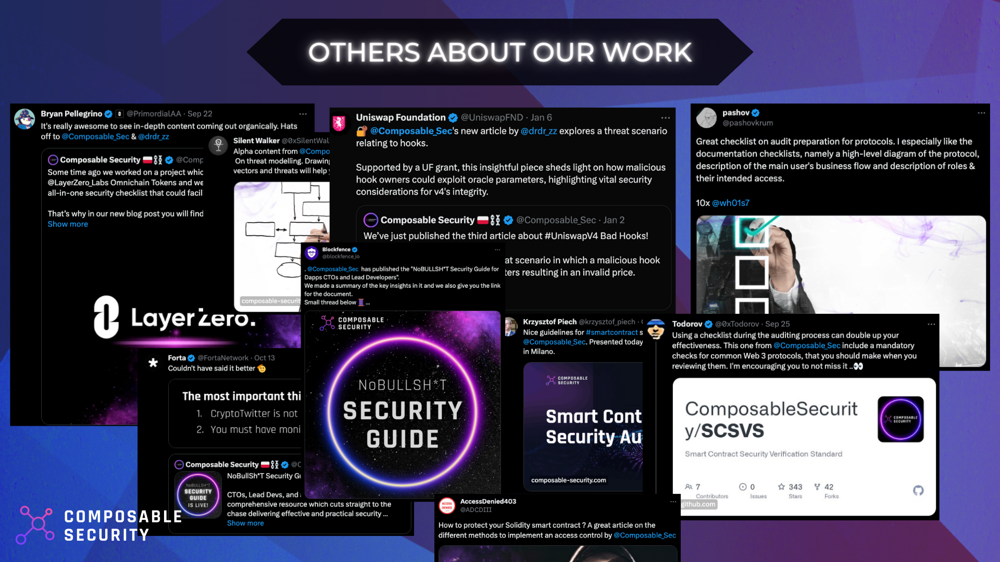

# Composable Security

## Get to know us
The [Composable Security 🛡️⛓️](https://twitter.com/Composable_Sec) is a small team with a holistic approach that goes beyond the code. A combination of **expertize in Solidity smart contract security** and experience gained through **6+ years securing global fintechs and Polish banks** help comprehensively take care of DApp security. Learn more [about us](https://composable-security.com/about/).

About our approach you can read here:
https://composable-security.com/blog/how-we-do-smart-contract-audit/

## Proud of 🏆
* **Creators of the first security standard** for smart contracts **[Smart Contract Security Verification Standard](https://github.com/ComposableSecurity/SCSVS)**.
* Our research was supported by **Uniswap Foundation** grant.
* Our articles are valued by projects like Morpho Blue, LayerZero.
* **Speakers & mentors** at EthCC, ETHGlobal London, Web3 Security Conference, EthereumZurich and more.
* Creators of the first **[Security Guide](https://composable-security.com/security-guide/)** for DApps (100+ pages of free knowledge).
* **First place during War Room Games** Paris @ EthCC 2023 organized by Yearn, yAudit, and Tenderly.
* In the previous company, we developed an interactive video program for developers that **trained 1,000+ developers**.

## Services
- Smart contract security reviews/audits
- Threat modeling
- Threat analysis
- Security consultation

Let us help you [info@composable-security.com](mailto:info@composable-security.com)

## Client reviews

## Professional collaboration

Companies that have allowed us to speak about our work can be found here:

| Client                                                      | Service                           | Date                  |                                                Report                                                |
| ----------------------------------------------------------- | --------------------------------- | --------------------- | :--------------------------------------------------------------------------------------------------: |
| [Golem Network](https://www.golem.network/)                 | Smart contract security review    | October 2025 | - |
| [Lido](https://lido.fi/)                                    | Security consultation & review    | October 2025 | - |
| [Neverland](https://neverland.money/)                       | Smart contract security review    | September 2025 | [📄](https://github.com/ComposableSecurity/.github/blob/main/reports/202509_Neverland_SelfRepay.pdf) |
| [Othentic](https://www.othentic.xyz/)                       | Smart contract security review    | September 2025 | - |
| [Neverland](https://neverland.money/)                       | Smart contract security review    | July - August 2025 | [📄](https://github.com/ComposableSecurity/.github/blob/main/reports/2025_08_Neverland.pdf) | |
| [Lido](https://lido.fi/)                                    | Security consultation & review    | July - August 2025 | - |
| [Lido](https://lido.fi/)                                    | Security consultation & review    | June 2025 | - |
| [Shroomy](https://www.shroomy.io/)                          | Smart contract security review    | May 2025 | [📄](https://github.com/ComposableSecurity/.github/blob/main/reports/2025_05_Shroomy_Staking.pdf) |
| [Constellation Network](https://constellationnetwork.io/)   | Security consultation & review    | March-April 2025 | - |
| [Lido](https://lido.fi/)                                    | Security consultation & review    | February-March 2025 | [📄](https://github.com/ComposableSecurity/.github/blob/main/reports/2025_02_Lido_Oracle_V5.pdf) |
| [Othentic](https://www.othentic.xyz/)                       | Smart contract security review    | February 2025 | [📄](https://github.com/ComposableSecurity/.github/blob/main/reports/2025_02_Othentic_RewardsV2.pdf) |
| [Arbiter Finance](https://arbiter.finance/)                 | Smart contract security review    | January 2025 | - |
| [Tellor](https://tellor.io/)                                | Smart contract security review    | January 2025 | - |
| [YieldNest](https://www.yieldnest.finance/)                 | Smart contract security review    | December 2024 | [📄](https://github.com/ComposableSecurity/.github/blob/main/reports/2024_12_YieldNest_Integration_with_Kernel.pdf) |
| [Arcade](https://www.arcade2earn.io/)                       | Smart contract security review    | December 2024 | - |
| [Bitquity](https://www.bitquity.org/)                       | Smart contract security review    | December 2024 | - |
| [pStake](https://pstake.finance/)                           | Smart contract security review             | November 2024            | - |
| Token Invest                                                | Smart contract security review             | October 2024            | - |
| [RedStone](https://redstone.finance/)                       | Smart contract security review and security consultation | October 2024            | [📄](https://github.com/ComposableSecurity/.github/blob/main/reports/2024_10_RedStone_AVS.pdf) |
| [Braintrust](https://www.usebraintrust.com/)                  | Security consultation             | August 2024            | [📄](https://github.com/ComposableSecurity/.github/blob/main/reports/2024_09_Braintrust.pdf)  |
| [Arcade](https://www.arcade2earn.io/)                       | Smart contract security review    | July 2024 |  [📄](https://github.com/ComposableSecurity/.github/blob/main/reports/2024_07_Arcade_Mission_Pools.pdf) |
| [ZND](https://znd.co/)                                        | Smart contract security review    | July 2024              | - |
| [Empirica](https://empirica.io/)                              | Security consultation             | July 2024              | - |
| [Flexy](https://www.flexy.tech/)                              | Smart contract security review    | June 2024              | [📄](https://github.com/ComposableSecurity/.github/blob/main/reports/2024_07_Flexy.pdf) |
| Tident IT                                                     | Smart contract security review    | June 2024              | - |
| [ICEO](https://iceo.co/)                                    | Security consultation             | May 2024              | - |
| FIDL: Filecoin Incentive Design Labs                        | Smart contract security review    | May 2024              | [📄](https://github.com/ComposableSecurity/.github/blob/main/reports/2024_05_FIDL_MetaAllocator.pdf) |
| [Sharbi](https://www.sharbi.net/)                           | Smart contract security review    | March-April 2024      |                                                  -                                                   |
| Outline Investments                                         | Security consultation             | March 2024            |                                                  -                                                   |
| [ChickenDAO](https://coconutchicken.com/)                   | Security consultation             | March 2024            | [📄](https://github.com/ComposableSecurity/.github/blob/main/reports/2024_03_ChickenDAO_TG_bot.pdf)  |
| [Arcade](https://www.arcade2earn.io/)                       | Smart contract security review    | January-February 2024 |  [📄](https://github.com/ComposableSecurity/.github/blob/main/reports/2024_02_Arcade_Mission_Pools.pdf) |
| [Gasbot](https://www.gasbot.xyz/)                           | Smart contract security review    | January 2024          | [📄](https://github.com/ComposableSecurity/.github/blob/main/reports/2024_01_Gasbot_V2.pdf)          |
| [codefunded](https://codefunded.com/)                       | Smart contract security review    | November 2023         | [📄](https://github.com/ComposableSecurity/.github/blob/main/reports/2023_11_Codefunded.pdf)         |
| [Uniswap Foundation](https://www.uniswapfoundation.org/)    | Security research on UniV4 Hooks  | October-December 2023 |                                                  -                                                   |
| [Research Portfolio](https://researchportfolio.co/research) | Smart contract security review    | August-September 2023 | [📄](https://github.com/ComposableSecurity/.github/blob/main/reports/2023_09_Research_Portfolio.pdf) |
| [evojam](https://evojam.com/)                               | Custom blockchain security review | May-June 2023         |                                                  -                                                   |
| [VolMEX Finance](https://volmex.finance/)                   | Smart contract security review    | April 2023            |                                                  -                                                   |
| [DIVA Protocol](https://www.divaprotocol.io/)               | Smart contract security review    | March 2023            | [📄](https://github.com/ComposableSecurity/.github/blob/main/reports/2023_03_DIVAprotocol.pdf)       |
| [Milky Ice](https://milkyice.io/)                           | Smart contract security review    | January 2023          | [📄](https://github.com/ComposableSecurity/.github/blob/main/reports/2023_01_MilkyIce.pdf)           |
| Outline Investments                                         | Security consultation             | December 2022         |                                                  -                                                   |
| Outline Investments                                         | Security consultation             | November 2022         |                                                  -                                                   |
| [FujiDAO Labs OU](https://www.fujidao.org/)                 | Smart contract security review    | November 2022         | [📄](https://github.com/ComposableSecurity/.github/blob/main/reports/2022_11_Fujidao_Labs_OU.pdf)    |
| [FujiDAO Labs OU](https://www.fujidao.org/)                 | Smart contract security review    | October 2022          |                                                  -                                                   |
| W3 CPI, Inc.                                                | Smart contract security review    | September 2022        |                                                  -                                                   |
| [Tellor Inc.](https://tellor.io/)                           | Smart contract security review    | August 2022           |                                                  -                                                   |

Many more remain confidential.

## Client case studies
* [Outline Investment](https://composable-security.com/blog/outline-investment-case-study/) - The primary goal was to develop a systematic approach for evaluating the risks associated with stablecoin pools, which Outline Investment was considering for potential investment opportunities.
* [Gasbot V2](https://composable-security.com/blog/gasbot-v-2-case-study/) - The main objective was verification of the security of smart contracts and identification of threats occurring at the edge of integration with web2 components.
* [Research Portfolio](https://composable-security.com/blog/research-portfolio-case-study/) - The main objective was verification of the security of smart contracts and identification of threats occurring at the edge of integration with web2 components.

## Contests

When the project is interesting or we have free slot, we take part in contests.

| Project                                                     |  H  | M | Place |                                               Description                                           |
| ----------------------------------------------------------- |  -  | - | ----- |:--------------------------------------------------------------------------------------------------:|
| [Titles](https://audits.sherlock.xyz/contests/326)         |  2  | 6 | **4th** out of 201 participants  |TITLES builds creative tools powered by artist-owned AI models. The underlying TITLES protocol enables the publishing of referential NFTs, including managing attribution and splitting payments with the creators of the attributed works.                        |
| [Mento](https://audits.sherlock.xyz/contests/187)         |  0  | 1 | **🥇1st** out of 83 participants |Mento is a decentralized platform used to launch and operate multi-currency stable assets. Today Mento supports 4 decentralized stable assets on the Celo blockchain: cUSD (Celo Dollar), cEUR (Celo Euro), cREAL (Celo Real) and eXOF (CFA Franc), with more coming soon.                        |
| [Tapioca](https://audits.sherlock.xyz/contests/170)         |  4  | 0 | **7th** out of 123 participants |The Omnichain Money Market & Unstoppable OmniDollar, Powered by LayerZero.                        |
| [Rio Network](https://audits.sherlock.xyz/contests/176)     |  2  | 1 | **7th** out of 248 participants |The liquid restaking network.                                                                     |

## Publications
* [Best ways to secure your X account](https://composable-security.com/blog/best-ways-to-secure-your-x-account/)
* [Uniswap V4: Bad hook with broken access control](https://composable-security.com/blog/uniswap-v-4-bad-hook-with-broken-access-control/)
* [Uniswap V4: Further research to improve hooks security](https://composable-security.com/blog/uniswap-v-4-further-research-to-improve-hooks-security/)
* [Protect your account: SIM swap hack](https://composable-security.com/blog/protect-your-account-sim-swap-hack/)
* [Uniswap V4: Oracle hook with malicious owner](https://composable-security.com/blog/uniswap-v-4-oracle-hook-with-malicious-owner/)
* [Uniswap V4: Liquidity Theft via Hook Fee](https://composable-security.com/blog/uniswap-v-4-liquidity-theft-via-hook-fee/)
* [Uniswap V4: Re-Initialization Leading to Funds Locked](https://composable-security.com/blog/uniswap-v-4-re-initialization-leading-to-funds-locked/)
* [Threats for Uniswap V4 hooks](https://composable-security.com/blog/threats-for-uniswap-v-4-hooks/)
* [How to choose the best smart contract auditing firm?](https://composable-security.com/blog/how-to-choose-the-best-smart-contract-auditing-firm/)
* [INSIDER! Impersonating others on GitHub](https://composable-security.com/blog/insider-impersonating-others-on-git-hub/)
* [Secure integration with LayerZero](https://composable-security.com/blog/secure-integration-with-layer-zero/)
* [White hack policy](https://composable-security.com/blog/white-hack-policy/)
* [Uniswap V4 - threat modeling for secure integration](https://composable-security.com/blog/uniswap-v-4-threat-modeling-for-secure-integration/)
* [Account Abstraction - a tale on the evolution of wallets](https://composable-security.com/blog/account-abstraction-a-tale-on-the-evolution-of-wallets/)
* [The Role of Access Control in Solidity Smart Contracts](https://composable-security.com/blog/the-role-of-access-control-in-solidity-smart-contracts/)
* [Understanding the Tornado Cash Governance Attack](https://composable-security.com/blog/understanding-the-tornado-cash-governance-attack/)
* [6 security sins of Web3 bridges](https://composable-security.com/blog/6-security-sins-of-web-3-bridges/)
* [Key threat based cross-checks](https://composable-security.com/blog/key-threat-based-cross-checks/)
* [How we do smart contract audit](https://composable-security.com/blog/how-we-do-smart-contract-audit/)
* [Shapella, EIP-4895, and challenges faced by staking protocols](https://composable-security.com/blog/shapella-eip-4895-and-challenges-faced-by-staking-protocols/)
* [DeFi price oracles - all you should know about a TWAP](https://composable-security.com/blog/de-fi-price-oracles-all-you-should-know-about-a-twap/)
* [WOW! ChatGPT-driven threat modeling for smart contracts](https://composable-security.com/blog/wow-chat-gpt-driven-threat-modeling-for-smart-contracts/)
* [NFT Best Practices - build safe](https://composable-security.com/blog/nft-best-practices-build-safe/)
* [Threat Modeling for Smart Contracts: Best Step-by-Step Guide](https://composable-security.com/blog/threat-modeling-for-smart-contracts-best-step-by-step-guide/)
* [Smart contract audit - the best tips on how to be prepared better](https://composable-security.com/blog/smart-contract-audit-the-best-tips-on-how-to-be-prepared-better/)
* [BNB Bridge hack ELI5 explained and visualised](https://composable-security.com/blog/bnb-bridge-hack-eli-5-explained-and-visualised/)

## Recorded presentations
* [ETHWarsaw 2022 - Security Panel](https://composable-security.com/blog/eth-warsaw-2022-security-panel/)
* [ETHWarsaw MeetUp - Bridge Sins Presentation](https://composable-security.com/blog/eth-warsaw-meet-up-bridge-sins-presentation/)
* [Secrets of Uniswap V4: A Deep Dive into Hooks Security](https://www.youtube.com/watch?v=VhEbnGSUdYY)
* [Filecoin Dev Summit #4 - How to be secure by design and not pay millions?](https://www.youtube.com/watch?v=kqIfljTpS8A)

## Public goods
* [Smart Contract Security Verification Standard](https://github.com/ComposableSecurity/SCSVS)
* [Security Guide](https://composable-security.com/security-guide/)
